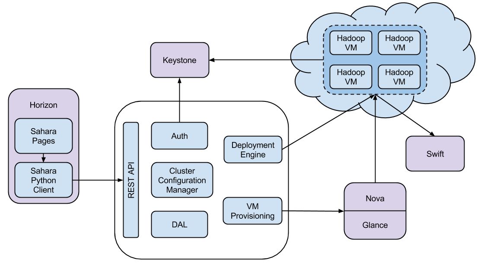

Architecture
============

The Sahara architecture consists of several components:

* Auth component - responsible for client authentication & authorization,
  communicates with the OpenStack Identity service (keystone).

* DAL - Data Access Layer, persists internal models in DB.

* Provisioning Engine - component responsible for communication with
  the OpenStack Compute (nova), Orchestration (heat), Block Storage (cinder)
  and Image (glance) services.

* Vendor Plugins - pluggable mechanism responsible for configuring and
  launching data processing frameworks on provisioned VMs. Existing
  management solutions like Apache Ambari and Cloudera Management Console
  could be utilized for that purpose as well.

* EDP - :doc:`../userdoc/edp` responsible for scheduling and managing
  data processing jobs on clusters provisioned by sahara.

* REST API - exposes sahara functionality via REST HTTP interface.

* Python Sahara Client - like other OpenStack components, sahara has
  its own python client.

* Sahara pages - a GUI for the sahara is located in the OpenStack Dashboard
  (horizon).
