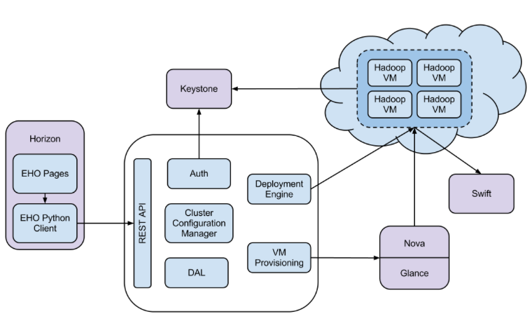

Elastic Hadoop on OpenStack Architecture (draft)
================================================

The EHO architecture consists of several components:

* Cluster Configuration Manager  - all the business logic resides here

* Auth component - responsible for client authentication & authorization

* DAL - Data Access Layer, persists internal models in DB

* VM Provisioning - component responsible for communication with Nova and Glance

* Deployment Engine - pluggable mechanism responsible for deploying Hadoop on provisioned VMs;
  existing management solutions like Apache Ambari and Cloudera Management Console could be utilized for that matter

* REST API - exposes EHO functionality via REST

* Python EHO Client - similar to other OpenStack components EHO has its own python client

* EHO pages - GUI for the EHO is located on Horizon
