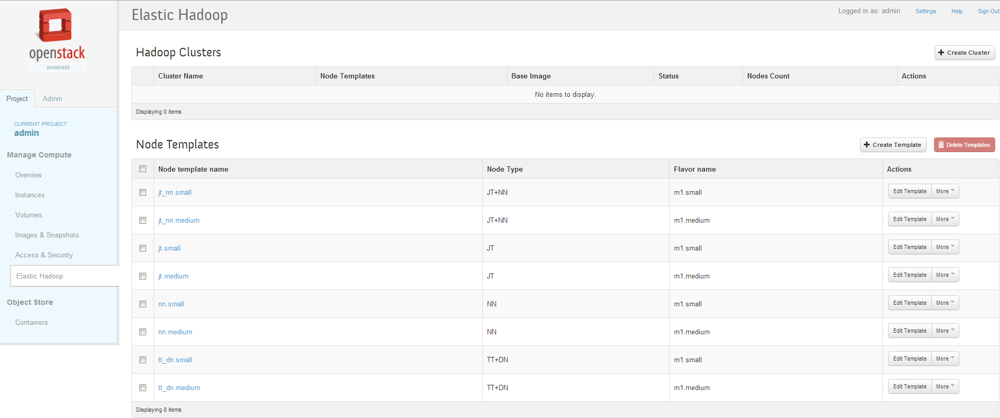
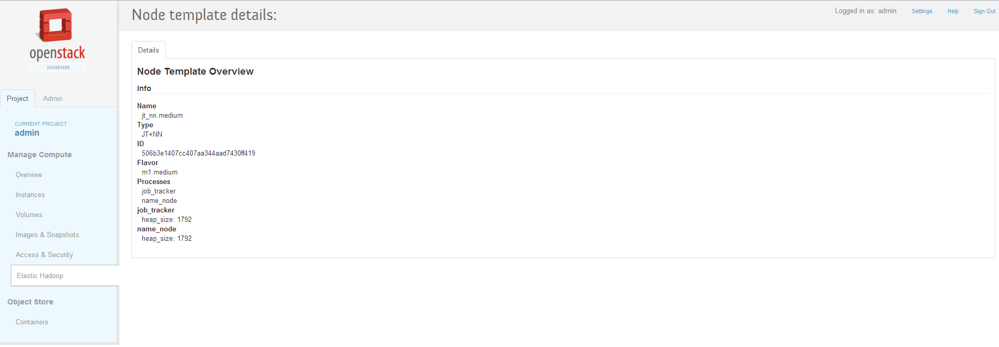
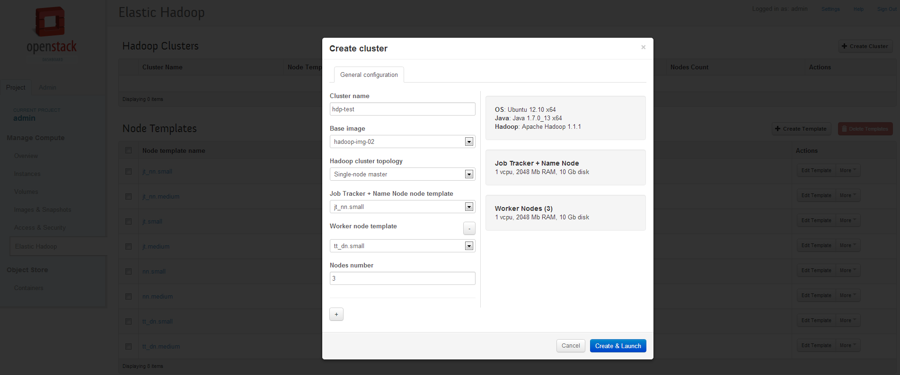
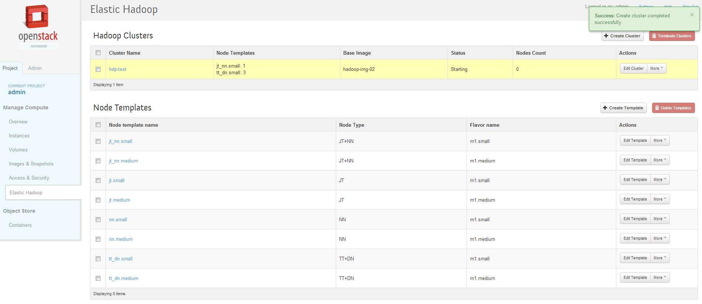
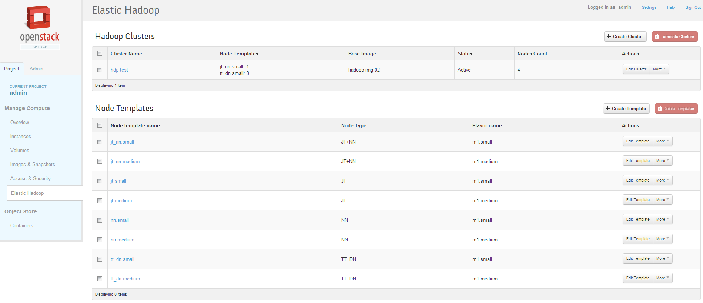
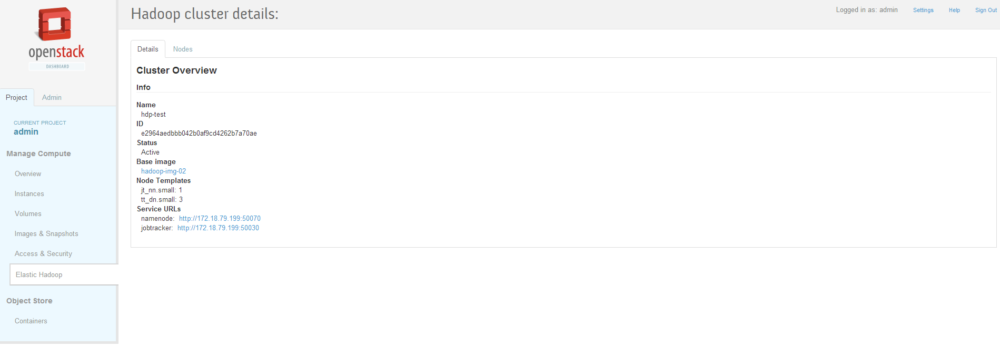

********************************
Custom Horizon pages for Savanna
********************************

Some pages has been implemented and there are some screenshots of it.
Screencast and sources of customized Horizon will be published at an early date.

1. Base page with Hadoop clusters list (empty cluster list).

2. Node template details page

3. Hadoop cluster creation wizard

4. Hadoop clusters page with new cluster in 'Starting' state

5. After some time, cluster is active

6. Hadoop cluster details page

