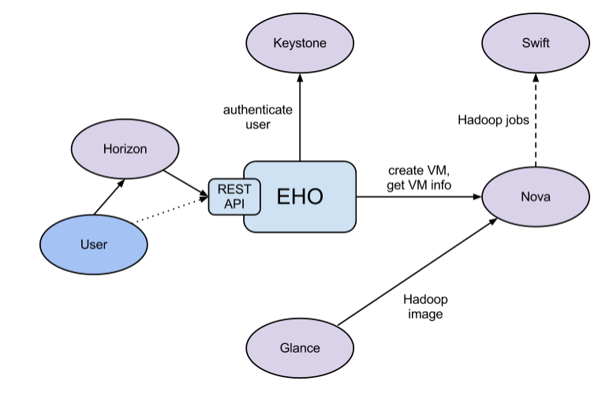

Rationale
=========

Introduction
------------

Apache Hadoop is an industry standard and widely adopted MapReduce
implementation, it is one among a growing number of data processing
frameworks. The aim of this project is to enable users to easily provision
and manage clusters with Hadoop and other data processing frameworks on
OpenStack. It is worth mentioning that Amazon has provided Hadoop for
several years as Amazon Elastic MapReduce (EMR) service.

Sahara aims to provide users with a simple means to provision Hadoop, Spark,
and Storm clusters by specifying several parameters such as the framework
version, cluster topology, hardware node details and more. After a user fills
in all the parameters, sahara deploys the cluster in a few minutes. Also sahara
provides means to scale an already provisioned cluster by adding or removing
worker nodes on demand.

The solution will address the following use cases:

* fast provisioning of data processing clusters on OpenStack for development
  and quality assurance(QA).
* utilization of unused compute power from a general purpose OpenStack IaaS
  cloud.
* "Analytics as a Service" for ad-hoc or bursty analytic workloads (similar
  to AWS EMR).

Key features are:

* designed as an OpenStack component.
* managed through a REST API with a user interface(UI) available as part of
  OpenStack Dashboard.
* support for a variety of data processing frameworks:

    * multiple Hadoop vendor distributions.
    * Apache Spark and Storm.
    * pluggable system of Hadoop installation engines.
    * integration with vendor specific management tools, such as Apache
      Ambari and Cloudera Management Console.

* predefined configuration templates with the ability to modify parameters.

Details
-------

The sahara product communicates with the following OpenStack services:

* Dashboard (horizon) - provides a GUI with ability to use all of sahara's
  features.
* Identity (keystone) - authenticates users and provides security tokens that
  are used to work with OpenStack, limiting a user's abilities in sahara to
  their OpenStack privileges.
* Compute (nova) - used to provision VMs for data processing clusters.
* Bare metal (ironic) - used to provision Baremetal nodes for data processing
  clusters.
* Orchestration (heat) - used to provision and orchestrate the deployment of
  data processing clusters.
* Image (glance) - stores VM images, each image containing an operating system
  and a pre-installed data processing distribution or framework.
* Object Storage (swift) - can be used as storage for job binaries and data
  that will be processed or created by framework jobs.
* Block Storage (cinder) - can be used to provision block storage for VM
  instances.
* Networking (neutron) - provides networking services to data processing
  clusters.
* DNS service (designate) - provides ability to communicate with cluster
  instances and Hadoop services by their hostnames.
* Telemetry (ceilometer) - used to collect measures of cluster usage for
  metering and monitoring purposes.
* Shared file systems (manila) - can be used for storage of framework job
  binaries and data that will be processed or created by jobs.
* Key manager (barbican & castellan) - persists the authentication data
  like passwords and private keys in a secure storage.

General Workflow
----------------

Sahara will provide two levels of abstraction for the API and UI based on the
addressed use cases: cluster provisioning and analytics as a service.

For fast cluster provisioning a generic workflow will be as following:

* select a Hadoop (or framework) version.
* select a base image with or without pre-installed data processing framework:

    * for base images without a pre-installed framework, sahara will support
      pluggable deployment engines that integrate with vendor tooling.

* define cluster configuration, including cluster size, topology, and
  framework parameters (for example, heap size):

    * to ease the configuration of such parameters, configurable templates
      are provided.

* provision the cluster; sahara will provision nodes (VMs or baremetal),
  install and configure the data processing framework.
* perform operations on the cluster; add or remove nodes.
* terminate the cluster when it is no longer needed.

For analytics as a service, a generic workflow will be as following:

* select one of the predefined data processing framework versions.
* configure a job:

    * choose the type of job: pig, hive, jar-file, etc.
    * provide the job script source or jar location.
    * select input and output data location.

* set the limit for the cluster size.
* execute the job:

    * all cluster provisioning and job execution will happen transparently
      to the user.
    * if using a transient cluster, it will be removed automatically after job
      completion.

* get the results of computations (for example, from swift).

User's Perspective
------------------

While provisioning clusters through sahara, the user operates on three types
of entities: Node Group Templates, Cluster Templates and Clusters.

A Node Group Template describes a group of nodes within cluster. It contains
a list of processes that will be launched on each instance in a group.
Also a Node Group Template may provide node scoped configurations for those
processes. This kind of template encapsulates hardware parameters (flavor)
for the node instance and configuration for data processing framework processes
running on the node.

A Cluster Template is designed to bring Node Group Templates together to
form a Cluster. A Cluster Template defines what Node Groups will be included
and how many instances will be created for each. Some data processing framework
configurations can not be applied to a single node, but to a whole Cluster.
A user can specify these kinds of configurations in a Cluster Template. Sahara
enables users to specify which processes should be added to an anti-affinity
group within a Cluster Template. If a process is included into an
anti-affinity group, it means that instances where this process is going to be
launched should be scheduled to different hardware hosts.

The Cluster entity represents a collection of instances that all have the
same data processing framework installed. It is mainly characterized by an
image with a pre-installed framework which will be used for cluster
deployment. Users may choose one of the pre-configured Cluster Templates to
start a Cluster. To get access to instances after a Cluster has started, the
user should specify a keypair.

Sahara provides several constraints on cluster framework topology. You can see
all constraints in the documentation for the appropriate plugin.

Each Cluster belongs to an Identity service project determined by the user.
Users have access only to objects located in projects they have access to.
Users can edit and delete only objects they have created or exist in their
projects. Naturally, admin users have full access to every object. In this
manner, sahara complies with general OpenStack access policy.

Integration with Object Storage
-------------------------------

The swift project provides the standard Object Storage service for OpenStack
environments; it is an analog of the Amazon S3 service. As a rule it is
deployed on bare metal machines. It is natural to expect data processing on
OpenStack to access data stored there. Sahara provides this option with a
file system implementation for swift
`HADOOP-8545 <https://issues.apache.org/jira/browse/HADOOP-8545>`_ and
`Change I6b1ba25b <https://review.opendev.org/#/c/21015/>`_ which
implements the ability to list endpoints for an object, account or container.
This makes it possible to integrate swift with software that relies on data
locality information to avoid network overhead.

To get more information on how to enable swift support see
:doc:`../user/hadoop-swift`.

Pluggable Deployment and Monitoring
-----------------------------------

In addition to the monitoring capabilities provided by vendor-specific
Hadoop management tooling, sahara provides pluggable integration with
external monitoring systems such as Nagios or Zabbix.

Both deployment and monitoring tools can be installed on standalone VMs,
thus allowing a single instance to manage and monitor several clusters at
once.
