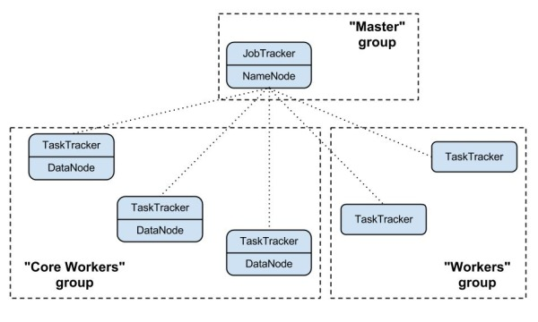

Getting Started
===============

Clusters
--------

A cluster deployed by sahara consists of node groups. Node groups vary by
their role, parameters and number of machines. The picture below
illustrates an example of a Hadoop cluster consisting of 3 node groups each
having a different role (set of processes).

Node group parameters include Hadoop parameters like ``io.sort.mb`` or
``mapred.child.java.opts``, and several infrastructure parameters like the
flavor for instances or storage location (ephemeral drive or cinder volume).

A cluster is characterized by its node groups and its parameters. Like a node
group, a cluster has data processing framework and infrastructure parameters.
An example of a cluster-wide Hadoop parameter is ``dfs.replication``. For
infrastructure, an example could be image which will be used to launch cluster
instances.

Templates
---------

In order to simplify cluster provisioning sahara employs the concept of
templates. There are two kinds of templates: node group templates and
cluster templates. The former is used to create node groups, the latter
- clusters. Essentially templates have the very same parameters as
corresponding entities. Their aim is to remove the burden of specifying all
of the required parameters each time a user wants to launch a cluster.

In the REST interface, templates have extended functionality. First you can
specify node-scoped parameters, they will work as defaults for node
groups. Also with the REST interface, during cluster creation a user can
override template parameters for both cluster and node groups.

Templates are portable - they can be exported to JSON files and imported
either on the same deployment or on another one. To import an exported
template, replace the placeholder values with appropriate ones. This can be
accomplished easily through the CLI or UI, or manually editing the template
file.

Provisioning Plugins
--------------------

A provisioning plugin is a component responsible for provisioning a data
processing cluster. Generally each plugin is capable of provisioning a
specific data processing framework or Hadoop distribution. Also the plugin
can install management and/or monitoring tools for a cluster.

Since framework configuration parameters vary depending on the distribution
and the version, templates are always plugin and version specific. A template
cannot be used if the plugin, or framework, versions are different than the
ones they were created for.

You may find the list of available plugins on that page: :doc:`plugins`

Image Registry
--------------

OpenStack starts VMs based on a pre-built image with an installed OS. The image
requirements for sahara depend on the plugin and data processing framework
version. Some plugins require just a basic cloud image and will install the
framework on the instance from scratch. Some plugins might require images with
pre-installed frameworks or Hadoop distributions.

The Sahara Image Registry is a feature which helps filter out images during
cluster creation. See :doc:`registering-image` for details on how to work
with Image Registry.

Features
--------

Sahara has several interesting features. The full list could be found here:
:doc:`features`
