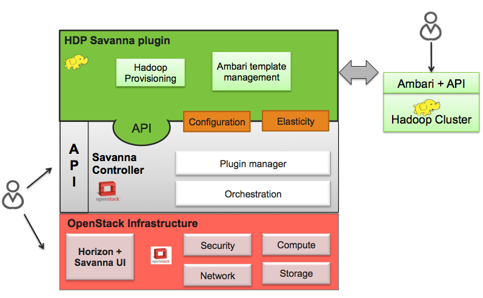

Hortonworks Data Platform Plugin
================================
The Hortonworks Data Platform (HDP) Sahara plugin provides a way to provision
HDP clusters on OpenStack using templates in a single click and in an easily
repeatable fashion. As seen from the architecture diagram below, the Sahara
controller serves as the glue between Hadoop and OpenStack. The HDP plugin
mediates between the Sahara controller and Apache Ambari in order to deploy
and configure Hadoop on OpenStack. Core to the HDP Plugin is Apache Ambari
which is used as the orchestrator for deploying HDP on OpenStack.

The HDP plugin can make use of Ambari Blueprints for cluster provisioning.

Apache Ambari Blueprints
------------------------
Apache Ambari Blueprints is a portable document definition, which provides
a complete definition for an Apache Hadoop cluster, including cluster topology,
components, services and their configurations. Ambari Blueprints can be
consumed by the HDP plugin to instantiate a Hadoop cluster on OpenStack.
The benefits of this approach is that it allows for Hadoop clusters to be
configured and deployed using an Ambari native format that can be used with as
well as outside of OpenStack allowing for clusters to be re-instantiated in a
variety of environments.

For more information about Apache Ambari Blueprints, refer to:
https://issues.apache.org/jira/browse/AMBARI-1783. Note that Apache Ambari
Blueprints are not yet finalized.

Operation
---------
The HDP Plugin performs the following four primary functions during cluster
creation:

1. Software deployment - the plugin orchestrates the deployment of the
   required software to the target VMs
2. Services Installation - the Hadoop services configured for the node groups
   within the cluster are installed on the associated VMs
3. Services Configuration - the plugin merges the default configuration values
   and user provided configurations for each installed service to the cluster
4. Services Start - the plugin invokes the appropriate APIs to indicate to the
   Ambari Server that the cluster services should be started

Images
------
The Sahara HDP plugin can make use of either minimal (operating system only)
images or pre-populated HDP images. The base requirement for both is that the
image is cloud-init enabled and contains a supported operating system
(see http://docs.hortonworks.com/HDPDocuments/HDP1/HDP-1.2.4/bk_hdp1-system-admin-guide/content/sysadminguides_ha_chap2_3.html).

The advantage of a pre-populated image is that provisioning time is reduced,
as packages do not need to be downloaded and installed which make up the
majority of the time spent in the provisioning cycle. In addition, provisioning
large clusters will put a burden on the network as packages for all nodes need
to be downloaded from the package repository.

For more information about HDP images, refer to
https://github.com/openstack/sahara-image-elements.

There are three VM images provided for use with the HDP Plugin, that can also
be built using the tools available in sahara-image-elemnts:

1. `sahara-juno-hdp-1.3.2-centos-6.5.qcow2 <http://sahara-files.mirantis.com/sahara-juno-hdp-1.3.2-centos-6.5.qcow2>`_:
   This image contains most of the requisite packages necessary for HDP
   deployment. The packages contained herein correspond to the HDP 1.3 release.
   The operating system is a minimal CentOS 6.5 cloud-init enabled install.
   This image can only be used to provision HDP 1.3 hadoop clusters.
2. `sahara-juno-hdp-2.0.6-centos-6.5.qcow2 <http://sahara-files.mirantis.com/sahara-juno-hdp-2.0.6-centos-6.5.qcow2>`_:
   This image contains most of the requisite packages necessary for HDP
   deployment. The packages contained herein correspond to the HDP 2.0.6
   release. The operating system is a minimal CentOS 6.5 cloud-init enabled
   install. This image can only be used to provision HDP 2.0.6 hadoop clusters.
3. `sahara-juno-hdp-plain-centos-6.5.qcow2 <http://sahara-files.mirantis.com/sahara-juno-hdp-plain-centos-6.5.qcow2>`_:
   This image provides only a minimal install of CentOS 6.5  and is cloud-init
   enabled. This image can be used to provision any versions of HDP supported
   by Sahara.

You could download well tested and up-to-date prepared images from
http://sahara-files.mirantis.com/images/upstream/kilo/

HDP plugin requires an image to be tagged in Sahara Image Registry with two
tags: 'hdp' and '<hdp version>' (e.g. '1.3.2').

Also in the Image Registry you will need to specify username for an image.
The username specified should be 'cloud-user'.

HDFS NameNode High Availability
-------------------------------
HDFS NameNode High Availability (Using the Quorum Journal Manager) can be deployed
automatically with HDP 2.0.6. Currently the only way to deploy it is through the
command line client (python-saharaclient) or Sahara REST API by simply adding the
following cluster_configs parameter in the cluster's JSON :

.. sourcecode:: cfg

        "cluster_configs": {
                "HDFSHA": {
                        "hdfs.nnha": true
                }
        }

Support for deploying the NameNode High Availability through Sahara Dashboard
will be added in the future.

The NameNode High Availability is deployed using 2 NameNodes, one active and
one standby. The NameNodes use a set of JOURNALNODES and ZOOKEEPER_SERVERS to
ensure the necessary synchronization.

A typical Highly available HDP 2.0.6 cluster uses 2 separate NameNodes, at least 3
JOURNALNODES and at least 3 ZOOKEEPER_SERVERS.

When HDFS NameNode High Availability is enabled, the plugin will perform the
following additional validations:

* Ensure the existence of 2 NAMENODES processes in the cluster
* Ensure the existence of at least 3 JOURNALNODES processes in the cluster
* Ensure the existence of at least 3 ZOOKEEPER_SERVERS processes in the cluster

Limitations
-----------
The HDP plugin currently has the following limitations:

* It is not possible to decrement the number of node-groups or hosts per node
  group in a Sahara generated cluster.

HDP Version Support
-------------------
The HDP plugin currently supports HDP 1.3.2 and HDP 2.0.6. Support for future
version of HDP will be provided shortly after software is generally available.

Cluster Validation
------------------
Prior to Hadoop cluster creation, the HDP plugin will perform the following
validation checks to ensure a successful Hadoop deployment:

* Ensure the existence of a NAMENODE process in the cluster
* Ensure the existence of a JOBTRACKER should any TASKTRACKER be deployed to
  the cluster
* Ensure the deployment of one Ambari Server instance to the cluster
* Ensure that each defined node group had an associated Ambari Agent configured

The HDP Plugin and Sahara Support
----------------------------------
For more information, please contact Hortonworks.
